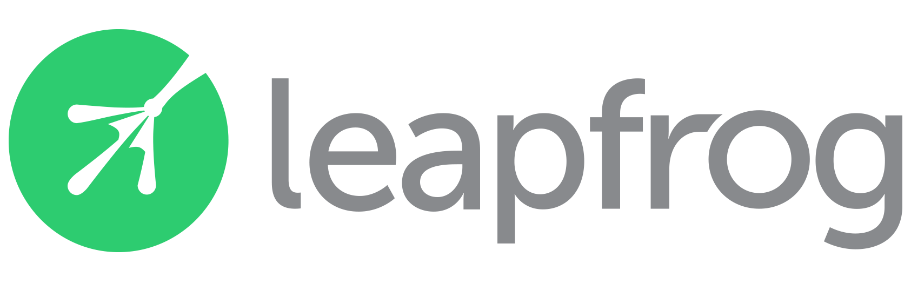

---

layout: col-sidebar
title: OWASP Nepal
site_side: true
tags: Nepal
level: 0
region: Asia


---
<H2> OWASP NEPAL </H2>

Welcome to the OWASP Nepal chapter home page. It is best security community of Nepal where security researcher, share tools and techniques related to web application security. The main aim of creating this community to bring all the cyber security expert together So let’s get together and move for securing web applications and improve the Nepal and Gobal cyber space.


 Social link
-------------
We have created a group and page in facebook for better communication and better knowledge sharing. Please join and support

* [Facebook Page ](https://www.facebook.com/OWASPNepal)
* [Join Group](https://www.facebook.com/groups/owasp.nepal)
   
Meeting Sponsors
---------------
Some of the organizations supporting OWASP Nepal by providing venue and techincal support for the meetings.
<table cellpadding="15" cellspacing="0" border="0">
<tr>
<td>
 <a href="#"></a>
</td>
<td>
 <a href="#"></a>
</td>
<td>
<a href="https://islington.edu.np/"></a>
</td>
<td>
 <a href="#"></a>
</td>
</tr>
 </table>
Speaking at OWASP Nepal Chapter Events
---------------------------------------

#### Call For Speakers for Events

Call For Speakers is open - if you would like to present a talk on Application Security at future OWASP  Nepal events - please review and agree with the [OWASP Speaker Agreement]() and send the proposed talk title, abstract and speaker bio to the Chapter Leaders via e-mail:

`nepal (at) owasp.org`

Code of Conduct
---------------
 
We hope you enjoy our events, we care deeply about inclusivity and diversity so that OWASP is a comfortable and welcoming community for everyone. Please reach out to one of our chapter leaders if you have any feedback or would like to speak to us, we take these matters very seriously. You can find out more about our policies [here](https://www.owasp.org/index.php/Governance/Conference_Policies)

<!-- Standard Chapter Page Template
This is an example of a Project or Chapter page.
Please change these items to indicate the actual information you wish to present. In addition to this information, the 'front-matter' above the text should be modified to reflect your actual information.  An explanation of each of the front-matter items is below:

{front matter for this file}

```
- layout: This is the layout used by project and chapter pages.  You should leave this value as col-sidebar
- title: This is the title of your project or chapter page, usually the name.  For example, OWASP Zed Attack Proxy or OWASP Baltimore
- tags: This is a space-delimited list of tags you associate with your project or chapter.  If you are using tabs, at least one of these tags should be unique in order to be used in the tabs files (an example tab is included in this repo) 
- region: This is the region you are in according to our data
```

{copy for this file (index.md)}
Replace the text above the commented area with your information in the format below:


Next Meeting/Event(s)
---------------------

{info.md}

This separate file is where you should place links to your Google Group and Meetup page. It will be automatically rendered in the column sidebar.

{leaders.md}

Another separate file that should simply include each leaders name with mailto link as a list. It will also be automatically rendered in the column sidebar.

-->
